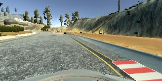
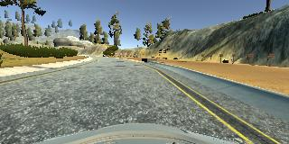
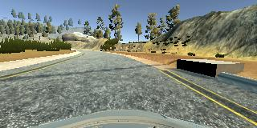

Behavioral Cloning
==================

**Behavioral Cloning Project**

The goals / steps of this project are the following: \* Use the simulator to
collect data of good driving behavior \* Build, a convolution neural network in
Keras that predicts steering angles from images \* Train and validate the model
with a training and validation set \* Test that the model successfully drives
around track one without leaving the road \* Summarize the results with a
written report

Rubric Points
-------------

### Here I will consider the [rubric points](https://review.udacity.com/#!/rubrics/432/view) individually and describe how I addressed each point in my implementation.

### Files Submitted & Code Quality

#### 1. Submission includes all required files and can be used to run the simulator in autonomous mode

My project includes the following files: \* model.py containing the script to
create and train the model \* drive.py for driving the car in autonomous mode \*
a number of model_\*.h5 files containing trained convolution neural networks \*
Some mp4 video files displaying the neural network driving the simulator \*
writeup_report.md summarizing the results

#### 2. Submission includes functional code

Using the Udacity provided simulator and my drive.py file, the car can be driven
autonomously around the track by executing

~~~~~~~~~~~~~~~~~~~~~~~~~~~~~~~~~~~~~~~~~~~~~~~~~~~~~~~~~~~~~~~~~~~~~~~~~~~~~~~~
python drive.py model_5_epochs.h5
~~~~~~~~~~~~~~~~~~~~~~~~~~~~~~~~~~~~~~~~~~~~~~~~~~~~~~~~~~~~~~~~~~~~~~~~~~~~~~~~

#### 3. Submission code is usable and readable

The model.py file contains the code for training and saving the convolution
neural network. The file shows the pipeline I used for training and validating
the model, and it contains comments to explain how the code works.

### Model Architecture and Training Strategy

#### 1. An appropriate model architecture has been employed

My model consists of a convolution neural network as described in the paper by
NVIDIA “End to End Learning for Self-Driving Cars”.

The model includes RELU layers to introduce nonlinearity, and the data is
normalized in the model using a Keras lambda layer.

#### 2. Attempts to reduce overfitting in the model

The model was trained and validated on different data sets to ensure that the
model was not overfitting. The model was tested by running it through the
simulator and ensuring that the vehicle could stay on the track.

#### 3. Model parameter tuning

The model used an adam optimizer, so the learning rate was not tuned manually.

#### 4. Appropriate training data

Training data was chosen to keep the vehicle driving on the road. I used a
combination of center lane driving, recovering from the left and right sides of
the road, and reversing driving from counter-clockwise to clockwise around the
track.

For details about how I created the training data, see the next section.

### Model Architecture and Training Strategy

#### 1. Solution Design Approach

The overall strategy for deriving a model architecture was to copy the tested
method presented by NVIDIA.

I thought this model might be appropriate because of the success NVIDIA has had
with self driving cars.

In order to gauge how well the model was working, I split my image and steering
angle data into a training and validation set. I found that my first model had a
low mean squared error on the training set but a constant or increasing mean
squared error on the validation set. This implied that the model was
overfitting.

To combat the overfitting, I modified the model so that it used less epochs,
from 7 to 2.

Then I tested. I found that with 2 epochs, the car would drive fairly well until
it hit a tight turn, at which time it would go off road. I then tried 5 epochs,
which worked properly with my training data until it hit a sharpe right turn
without barrier indicators.

I added some “recovery” training data, showing how to move back to the middle if
the car is on the edge.

Combined with changing to 5 epochs, this proved successful.

The final step was to run the simulator to see how well the car was driving
around track one.

At the end of the process, the vehicle is able to drive autonomously around the
track without leaving the road.

#### 2. Final Model Architecture

The final model architecture consisted of a convolution neural network with the
following layers and layer sizes:

\* a Lambda layer, normalizing the data

\* a Cropping layer, removing the top 70 and bottom 25 lines of pixes. This
removed distracting data from the input so that trees and mountains didn’t
affect the CNN’s decisions.

\* Three convolutional layers of heights 24, 36, and 48, with stride of 2,2.
These had activation layers of “relu”.

\* Two convolutional layers of heights 64, and strides of 3,3. These have the
Keras default linear activation layers.

\* A flattening layer.

\* 4 direct connection layers, Dense, of 100, 50, 10 and 1.

#### 3. Creation of the Training Set & Training Process

To capture good driving behavior, I first recorded two laps on track one using
center lane driving counter-clockwise, and two lapse clockwise. Here is an
example image of center lane driving:

Center lane clockwise driving.

I then recorded the vehicle recovering from the left side and right sides of the
road back to center so that the vehicle would learn to recover when it found
itself out of bounds. These images show what a recovery looks like starting from
... :

Going out of bounds

Straightening out

Nearly corrected.

I did not augment the data set by flipping. Or adding left or right camera data.

After the collection process, I had 13,490 data points.

I finally randomly shuffled the data set and put 20% of the data into a
validation set.

I used this training data for training the model. The validation set helped
determine if the model was over or under fitting. The ideal number of epochs was
5 as evidenced by the car staying on the road.

The final results can be seen in the videos created from the CNN driving the
simulator, named “good_run.mp4” and “run_5_epochs.mp4”. Each show the car going
around the track without finding a river, dirt trail, or other off-limits area.

I used an adam optimizer so that manually training the learning rate wasn't
necessary.
